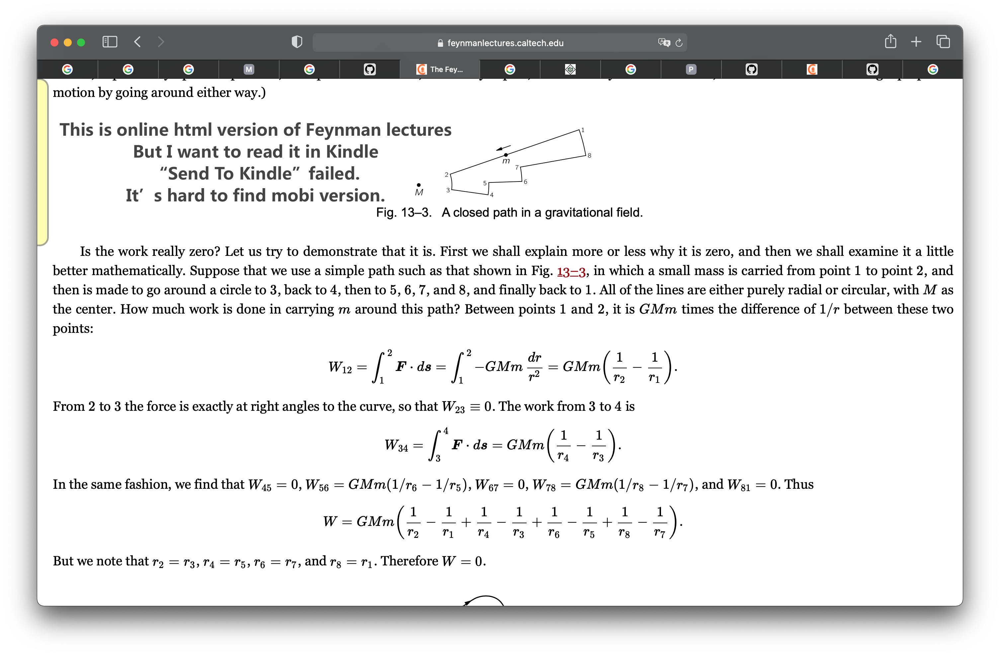
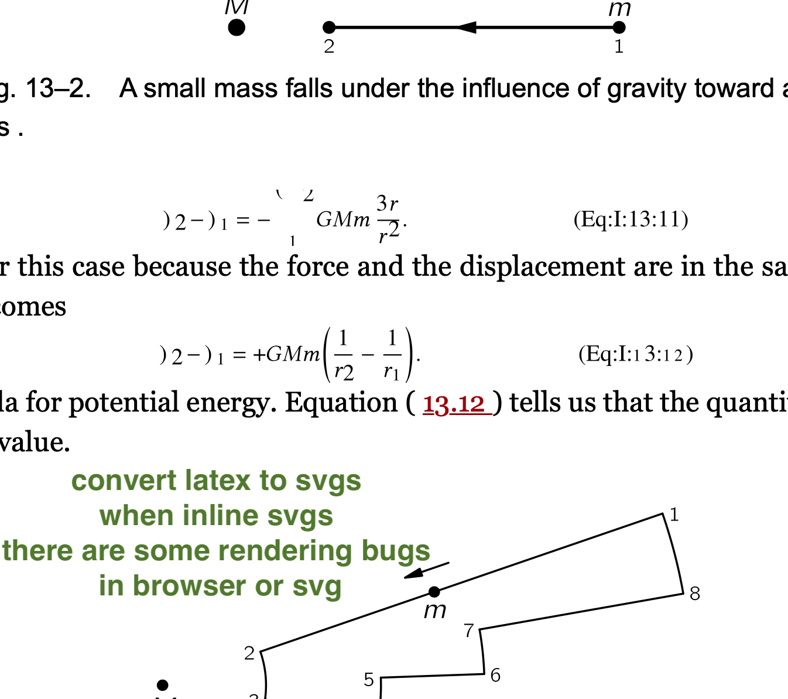
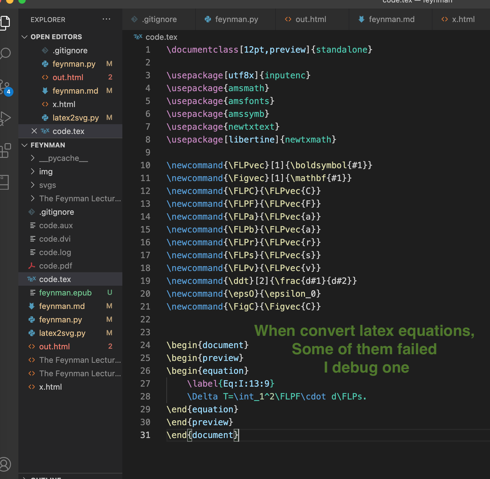
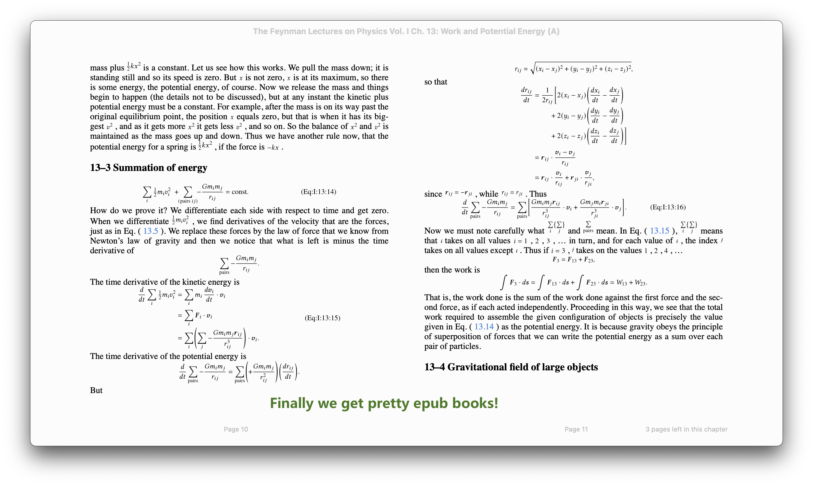

# feynman-lectures-mobi
convert feynman lectures online html pages to mobi e-book









### How to run

```shell
python feynman.py

pandoc -s -r html out.html -o feynman.epub
```

### Thanks

Thanks to the project [tuxu/latex2svg](https://github.com/tuxu/latex2svg). The `latex2svg.py` in this project is modified from that project.